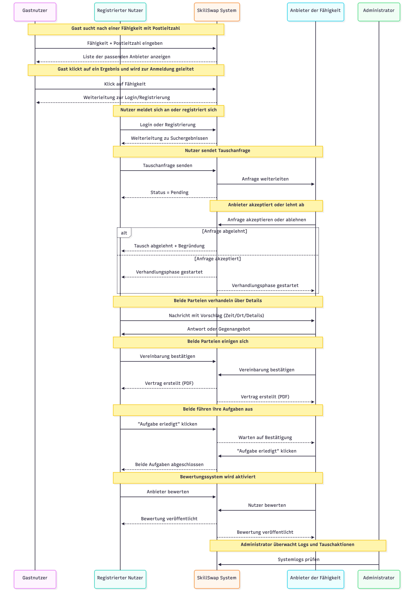

# Skill Swap Website 🔄

A web platform where users can exchange skills with each other — built with Django and Python.

## 🚀 Features

- User registration and authentication
- Create and browse skill listings
- Match users based on skills offered and needed
- Responsive design with HTML, CSS, JavaScript

## 🛠️ Tech Stack

- **Backend:** Python, Django
- **Frontend:** HTML5, CSS3, JavaScript
- **Database:** SQLite / MySQL
- **Tools:** Git, VS Code

## 📸 Screenshots




## ⚙️ Installation

```bash
git clone https://github.com/javidsalihe/Skill-Swap-websites-with-django-
cd Skill-Swap-websites-with-django-
pip install -r requirements.txt
python manage.py migrate
python manage.py runserver
```

## 👨‍💻 Developer

Javid Salihe — Junior Software Developer | Berlin
[LinkedIn](https://linkedin.com/in/ali-6897a3333) · [GitHub](https://github.com/javidsalihe)
